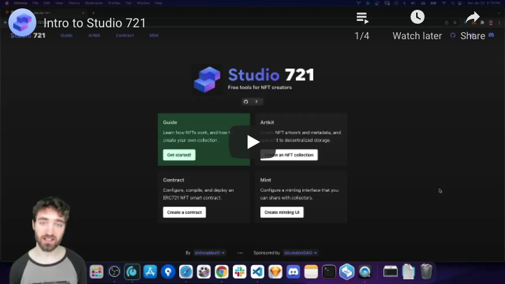

# Studio 721

[Studio 721](https://721.so) is a collection of free tools for NFT creators,
built by [@dvnabbott](https://twitter.com/dvnabbott) and sponsored by
[@LondonDAO](https://twitter.com/LondonDAO).

## Video

A brief intro to Studio 721:

<a href="https://youtu.be/iWV5c_HWUw8?list=PLu07TXQzA0jo9RuBstWDDmm1LOorye3aP" rel="nofollow">

</a>

This video is first of a 4-part video walkthrough!

## Tools

There are currently 4 tools as part of Studio 721:


<ul><ul>
<a href="https://721.so/guide"><b>Guide</b></a><br/>
Learn how NFTs work, and how to create your own collection.
</ul></ul>


<ul><ul>
<a href="https://721.so/artkit"><b>Artkit</b></a><br/>
Create NFT artwork and metadata, and upload it to decentralized storage.
</ul></ul>


<ul><ul>
<a href="https://721.so/contract"><b>Contract</b></a><br/>
Configure, compile, and deploy a custom ERC721 NFT smart contract.
</ul></ul>


<ul><ul>
<a href="https://721.so/mint"><b>Mint</b></a><br/>
Configure a minting interface that you can share with collectors.
</ul></ul>

## Development

To set up this repository, you'll need node.js >= 16.3 and yarn installed.

```bash
yarn

cd packages/studio721

yarn dev
```

## Repository Structure

This is a monorepo managed by
[modular](https://github.com/jpmorganchase/modular).

## License

MIT
